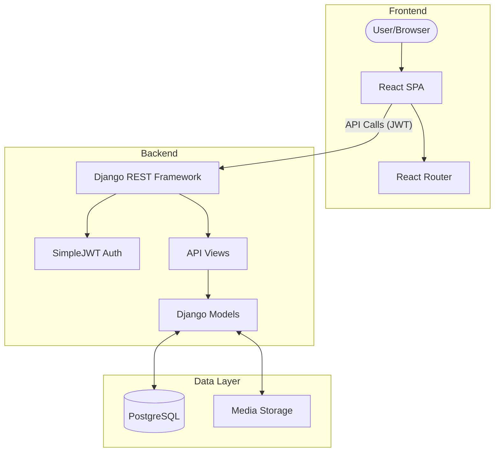

# Modern E-Commerce Store

A full-stack, scalable e-commerce platform built with **Django REST Framework** and **React**. This project demonstrates a decoupled architecture, secure JWT authentication, and a robust admin dashboard for platform management.

## 🚀 Project Overview

The **Modern E-Commerce Store** is designed to provide a seamless shopping experience for customers and a powerful management interface for administrators. It solves the problem of centralized inventory management and secure customer transactions through a modular, service-oriented architecture.

### Key Features
- **Decoupled Architecture**: Clean separation between the React SPA and Django API.
- **JWT Authentication**: Secure, token-based authentication for customers and admins.
- **Advanced Admin Dashboard**: Custom React-based dashboard for real-time inventory and category management.
- **Audit Logging**: Comprehensive activity tracking for administrative operations.
- **Responsive Design**: Optimized for desktop, tablet, and mobile devices.

---

## 🛠 Technology Stack

### Backend
- **Framework**: [Django 6.0](https://www.djangoproject.com/)
- **API**: [Django REST Framework (DRF)](https://www.django-rest-framework.org/)
- **Authentication**: JWT via [SimpleJWT](https://django-rest-framework-simplejwt.readthedocs.io/)
- **Database**: [PostgreSQL](https://www.postgresql.org/)
- **Package Management**: Pipenv, requirements.txt

### Frontend
- **Framework**: [React 18](https://reactjs.org/)
- **Build Tool**: [Vite](https://vitejs.dev/)
- **Routing**: React Router DOM (v6)
- **Styling**: Modern Vanilla CSS with CSS Variables (Responsive)

### Dev Ops & Tools
- **Containerization**: [Docker](https://www.docker.com/) (PostgreSQL service)
- **Version Control**: Git

---

## 🏗 High-Level Architecture

The system follows a classic client-server model with a decoupled frontend and backend. 



---

## 📂 Project Structure

```text
E_commerce_store/
├── backend/                # Django REST API & Configuration
│   ├── e_commerce/         # Core settings and URL routing
│   ├── products/           # Product and Category domain logic
│   ├── users/              # User models, Auth, and Activity Logging
│   ├── cart/               # Session/Cart management
│   ├── orders/             # Order processing logic
│   ├── media/              # User-uploaded assets (images)
│   ├── manage.py           # Django management entry point
│   └── populate_db.py      # Seed data script
├── frontend/               # React SPA (Vite project)
│   ├── src/
│   │   ├── api.js          # Centralized API service layer
│   │   ├── App.jsx         # Main routes and application shell
│   │   └── cart.js         # Client-side cart persistence
│   └── vite.config.js      # Build & Proxy configuration
├── docker-compose.yml      # Database service definition
└── development_guide.md    # Detailed developer documentation
```

---

## ⚙️ Installation & Setup

### 1. Prerequisites
- Python 3.10+
- Node.js 18+
- Docker & Docker Compose

### 2. Backend Setup
```bash
cd backend
# Create virtual environment and install dependencies
pip install -r requirements.txt

# Start PostgreSQL using Docker
docker-compose -f ../docker-compose.yml up -d

# Run migrations
python manage.py migrate

# Seed initial data (optional)
python populate_db.py

# Start the API server
python manage.py runserver
```

### 3. Frontend Setup
```bash
cd frontend
npm install
npm run dev
```
The application will be available at `http://localhost:5173`.

---

## 🔌 API Endpoints (High Level)

| Endpoint | Method | Description | Auth Required |
|----------|--------|-------------|---------------|
| `/api/products/` | GET | List all products | No |
| `/api/products/:id/` | GET | Product detail | No |
| `/api/users/login/` | POST | Obtain JWT tokens | No |
| `/api/users/register/` | POST | Customer registration | No |
| `/api/users/me/` | GET | Get current user info | Yes (JWT) |
| `/api/users/admin-actions/`| GET | List admin activities | Yes (Admin) |

---

## 🧠 Design Decisions & Engineering Principles

- **Modular Domain Logic**: Each business domain (products, users, orders) is isolated into its own Django app, promoting maintainability and testability.
- **Separation of Concerns**: The frontend is strictly responsible for UI and state management, communicating with the backend over a stateless REST API.
- **Validation & Error Handling**: Centralized error handling in the frontend `api.js` ensures consistent user feedback across all network operations.
- **Auditability**: Use of `AdminActivity` and `CustomerLoginActivity` models provides a transparent audit trail for security and troubleshooting.

---

## 🔮 Future Improvements

- [ ] Implementation of a backend-side cart persistent storage.
- [ ] Integration with a payment gateway (Stripe/PayPal).
- [ ] Cloud storage integration (S3) for media files.
- [ ] Comprehensive unit and integration test suite.

## 📄 License

This project is licensed under the [MIT License](LICENSE) - see the [LICENSE](LICENSE) file for details.
